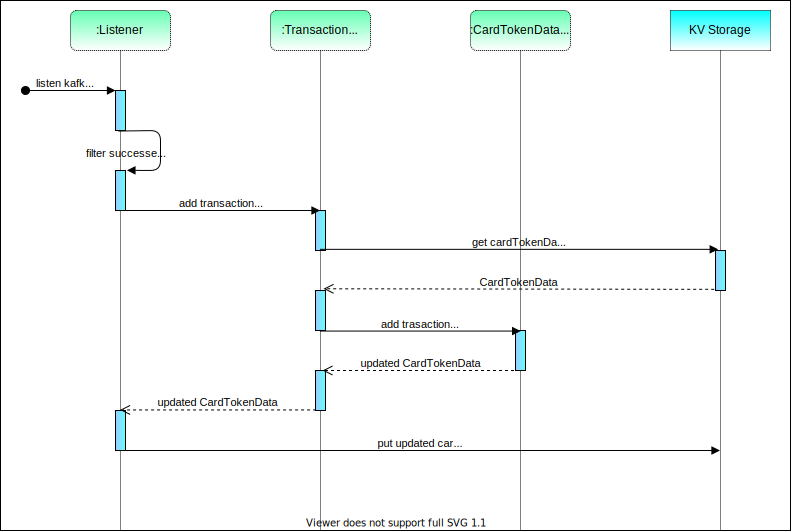
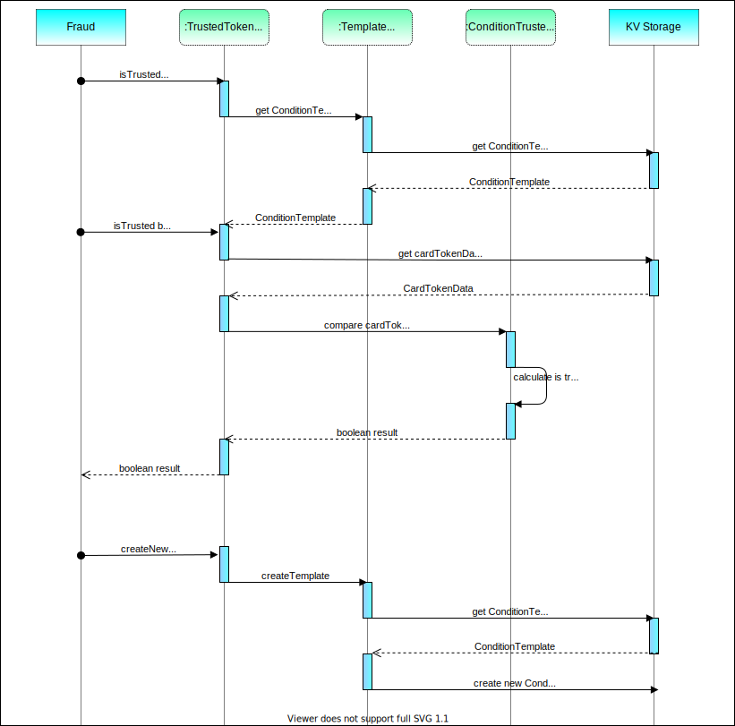

# trusted-tokens-manager

trusted-tokens-manager - сервис, предназначенный для определения вторичного трафика.

Сервис обладает следующим функционалом:

- Сбор и хранение информации о платежах и выплатах по токенам

- Обработка запросов от антифрода для проверки, входит ли токен в список доверенных

- Обработка запросов от антифрода, сигнализирующих о необходимости формирования нового шаблона
  с условиями для определения доверенных токенов

## Описание работы сервиса

Сервис читает из кафки события с информацией о платежах и выплатах и заполняет на их основе kv storage, где key - токен
карты, value - **CardTokenData**: набор данных по сумме и количеству операций по платежам и количеству по выплатам за 
последние три года. 
Данные группируются по валютам и годам. По каждому году данные группируются по месяцам.

Для определения является ли токен доверенным от фрода будет поступать запрос с условиями проверки.
Условия, по которым будет происходить определени токенов карты, группируются в **ConditionTemplate**:
набор условий, по которым токен может считаться доверенным: вид операции (платеж или выплата), количество лет, за 
которые необходима проверка, валюта, сумма и количество операций.

### Взаимодействие с kafka:

Сервис читает из кафки события с информацией о платежах и выплатах.
Для платежей выбирает события captured, для выплат - succeeded.
При получении необходимой операции сервис запрашивает в хранилище CardTokenData по токену карты.
При получении CardTokenData сервис добавляет сумму и количество платежей для текущего года и месяца на сумму 
операции. При необходимости удаляет данные старше трех лет и сохраняет обновленные данные по токену в хранилище.

Общая схема взаимодействия:

### Взаимодействие с fraud

При необходимости проверки, входит ли токен в список доверенных фрод отправляет запрос в сервис c токеном, по которому 
необходимо узнать результат и ConditionTemplate, по которому будет определяться, является ли токен доверенным. 
При получении запроса на проверку сервис запрашивает в базе CardTokenData и сопоставляет подходят ли данные 
CardTokenData под условия ConditionTemplate.

В сервисе предусмотрена возможность предсохранения ConditionTemplate: фрод может передать в сервис
ConditionTemplateRequest, содержащий название шаблона и ConditionTemplate. Сервис сохранит ConditionTemplate в 
хранилище, где key будет название шаблона, value - ConditionTemplate.
Впоследствии для проверки вхождения токена в список разрешенных фрод сможет присылать токен и название шаблона.

Общая схема взаимодействия:

Протокол взаимодействия описан [тут](https://github.com/rbkmoney/trusted-tokens-proto).
